Cloud Culture

#### Code Institute Full Stack Development Dipoloma: Milestone Project 4 - Fullstack Framework
##### Created by William Donovan

# Table of Contents 

1. [UX Development](#uxdev)
   - Project Manifesto and Aim
   - User Stories 
   - Design Principles 
     * Fonts
     * Icons
     * Colours
     * Layout
   - Sitemap and Wireframes
   - Features and Future Implementations 
2. [Testing](#testing)
   - App Functionality Testing
      * Setting up Django Environment
      * Python App Views
   - Life Cycle
      * Home Page
      * Products
      * Bag
      * Checkout
      * Models
   - HTML, CSS and Python checks
      * HTML
      * CSS
      * Python
   - User Testing
   - Manual Testing
   - Automatic Testing
3. [Mongo Databse](#mongodb)
4. [Bugs / De-bugging / Syntax Issues](#bugs)
   - Errors
   - Bugs
5. [Technologies Used](#languages)
   - Languages Utilised
   - Online Material
   - Tools and Databases Used
6. [Project Deployment](#deployment)
   - Process of Deployment
      * Heroku
      * AWS S3 Bucket
   - How to create Local Version
7. [References](#references)
8. [Acknowledgements](#acknowledge)

# UX Development 

## Project Manifesto and Aim 
With a recent influx in vaping culture, especially over in the US, I decided to base my final project; an E-Commerce shop, around this culture. Over the last five years, not just myself but my Dad esepcially, has given up smoking in place of using E-cigarettes. Although they haven't been around for long enough to have done extensive research on them, the difference health wise it has done for us is incredible. I want Cloud Culture to not just be a place for buying vapes but put emphasis on the blog side, allowing users to post stories, information and awareness to help keep the culture growing but also safe. 

## User Stories
The target audience for this will be predominantly 18-50. Vaping in the UK is not illegal under the age of 18 but it is however illegal to sell to anyone under the age of 18.
## As an Unregistered User I want to:
* Be able to browse through all the products and blog posts
* Have the ability to add items to my bag
* Be able to remove, ammend and update the bag
* Be able to contact the site

## As a Registered User I want to:
* Be able to fast checkout seeing as my details will already be stored/saved
* Access my basic account details
* Have the ability to make blog posts as my username
* Have the ability to log in with my details
* Be able to update my shipping and billing details
* Be able to contact the site regarding an order

## As the Site Owner I want to:
* Be able to log in to the Admin Panel
* Be able to add, update or remove products, without vistiting the admin panel
* Receive email notifications when a user submits through the contact page

# Design Principles

## Overall Feel
I wanted to create a site that reflects the name Cloud Culture but also the overall vape asthetic. To achieve this, my overall site will be based on white, which is a difference to my usual black/dark style. Hopefully this will make it feel more open and airy. 

## Fonts
For my site font I decided to use a variation of Sans Serif called Rubik. I chose this font because it was professional enough but maintained a soft, rounded feel to match the shops products/ideals.
[Rubik](https://fonts.google.com/specimen/Rubik#standard-styles)
   
## Icons
I decided to use Font Awesome Icons again for this project.
[Font Awesome](https://fontawesome.com/v5.15/icons?d=gallery&p=2)

# Sitemap / Wireframes

# Features / Future Implementations

--------------------

# Testing 

## App Functionality Testing

### **Setting up Django environment**
To setup my Django framework and begin developmnent, I checked through four stages:
* Installed Django using **pip3 install django**
* Created the admin folders inside the main directory using **django-admin startproject (project name)**
* Made sure the server was working by starting it with **python3 manage.py runserver**
* Once I was shown a success Django message on Port8000, I made the inital database migrations with **python3 manage.py migrate**

### **Python App Views**
Process of setting up views with Django and Python:
* First setp was to initiate a home app using **manage.py startapp home** and insert a templates folder
* After creating the basic blocks ie.  inside **index.html**, the next step is to create a view for this template inside the 'home' **views.py** - insert photo of basic first view
* From here, the **urls.py** content was copied from the main directory into another **urls.py** file inside the 'home' app template, to be used as a shell
* Once the path has been created in the 'home' **urls.py** file, a path to the shell is needed inside the project level **urls.py** file
* The last thing to do is add the 'home' app into **settings.py** and wire up the template directories (root and the custome allauth)

### **Creating Models**
Process of creating models for Python apps to work:
* Create the intended app with **python3 manage.py 'app_name' startapp**
* Inside the app, locate **models.py** to start building the models
* Depending on the scope and how developed the entire project is, one needs to make sure to import all the neccessary settings and other models needed from the project scope.
For instance, importing the project level configurations with **from django.conf import settings** and in the case of this project, importing **projects.model** into the "checkout app" so that we can use Product information such as price, quantity etc in the checkout models.
* Once all the neccessary models have been initialised, we need to migrate the changes into the project directory. Using **python3 manage.py makemigrations --dry-run**, we can see what operations are set to be migrated, if all looks well, one can makemigrations and then migrate the new models into the project. 

## Life Cycle

### Home Page
Upon setting up my Django environment and establising allauth is functional, the first step was to copy accross the allauth templates into my directory for customisation.
Inside the 'templates' folder is where these and my other frontend templates are stored. 

The next step was to create the 'home' app in which my 'index' and other frontend page views would be rendered from. After setting up my first app view, if working, the 'index.html' should render 'We Are Working' as a bootstrap success class. This helped with making sure not only the app view was working but also Bootstrap and the JS script tags.
- Insert screen shot of We Are Working

After setting up all my functionality, I could start to build the homepage. My first stage was to create a basic template using Bootstrap and some basic HTML. The process started by making a header for nav links, search bar and logo, the main banner image container and the basic 'Shop Now' button. Once all these components were working and in place, I linked my **base.css** style sheet to the **base.html** file and styled the content. Below is an image of the groundwork used to build the homepage:
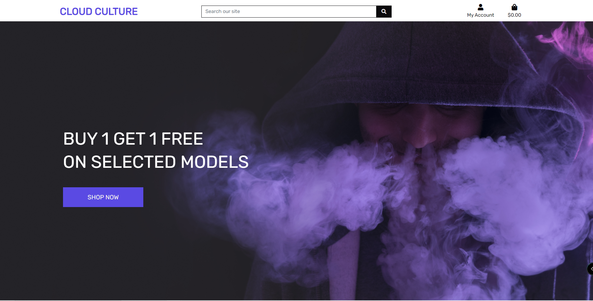

### Products

The next process of my build was to create some "json" fixtures for my products and categpories to go. At first I was slightly confused how to make these from scratch but after making my mentor Gerry explained the "many to one" and "one to many" theory with database structure, the schema made sense which in turn, helped build the models and fixtures. After making the initial 7 categories, I tried adding my products via the admin panel on the site. Unfortuantely, only the images uplaoded transferred into the project directory, the "json" file was not updated with product information. From here, I manually built the product fixture and input, two sets of item data to test it was pulling through. Following the cmd "python3 manage.py loaddata products", on the products page I was met with two product query sets as text, which indicated success, see image below:
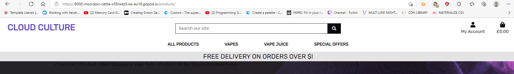

Once I knew the product query sets were loading, I could move on to creating the products in the "products.json" and render the fixtures on to the "all_products" template page. Bar the uncentered line, everything pulled through well from the backend and all the product images, price and other information were displayed on the page as should be:
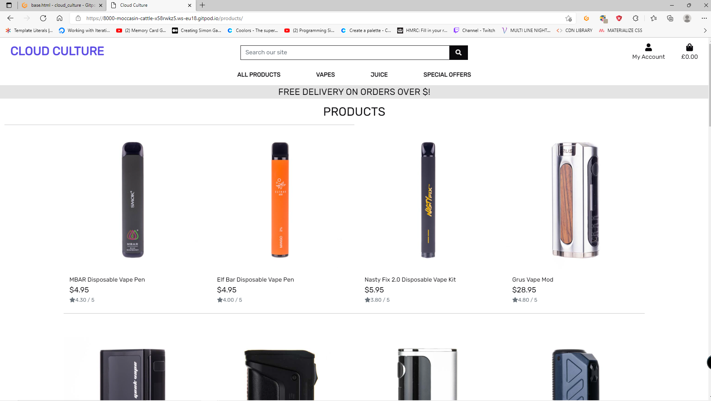

### Shopping Bag

After this I focused on the shopping bag functionality. Once the views, template and urls were developed, I aimed to test the **add_to_bag** function as a print request to the terminal. After a few bug corrections, I was able to add a few products to the bag and have their **PK** show up with the amount ordered in the terminal. See below:
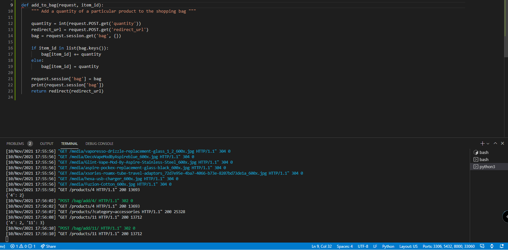

Made some slight structural changes to my categories. The liquid is now categorised by flavour rather than "Vape_liquid". Hoping this will help with user experience and overall use of the site.

Found the bag and increment buttons the hardest part of the project this far. For some reason, I ran into an incredible amount of bugs that needed me to revert back to older commits beacuse the code got too messy. The button would work but for some reaon, on the single product page, pressing "+" would add that item to the bag and vice versa for the "-". Starting from the beginning, I started with making the buttons on this page increase/decrease the item amount first. For this section, I had to mimic quite closely the code from the mini "Boutique Ado" project to get it working. By starting from foundation, I was able to get the shopping bag page fully functional and able to move onto the next stage:
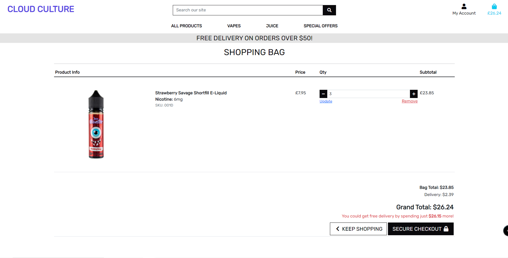

### Checkout

The first stage in creating the checkout section for the site was building the backend so that orders placed, initialise an order in the admin section. After successfully creating the app, models and admin.py, the intended section on the admin backend was rendered with the correct model fields and product info.
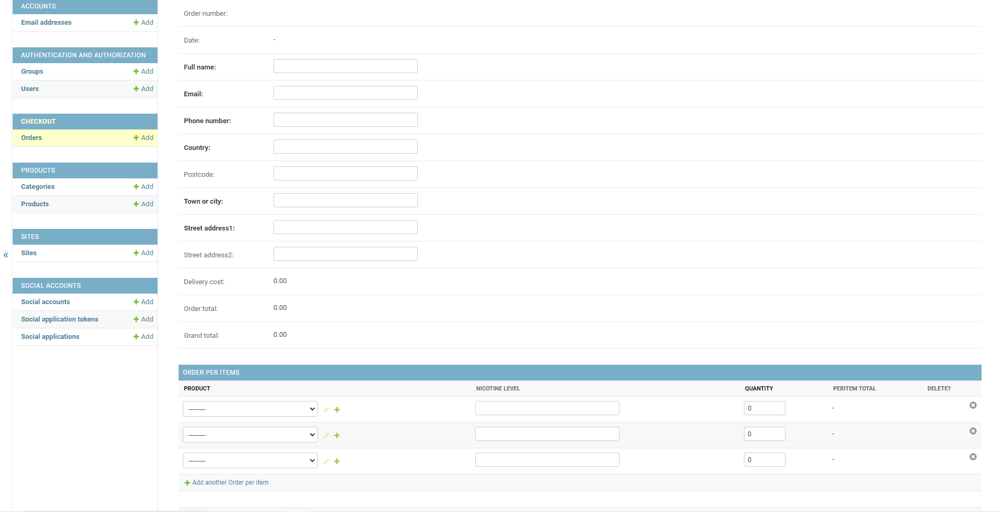

After some bugs and error tweaks, my checkout page displaying all the correct information, forms and content:
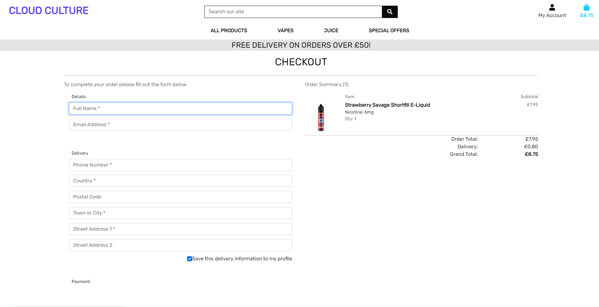

The payment stage and order per user definitley took the most time to set up and working completely. I decided to focus on getting this finished before coming back to make my own Blog model. Eventually, everything was error free and completely working as you can see from the screen shots below:
- checkout success image
- user profile image
- admin update / delete

### Models

_Blog_
From here I was able to move on to my blog / review and order enquiry models. The first step was to create the app and model, create a few json fixtures for 3 blog categories, migrate the model changes and load the fixture. This was all successful with no issues as shown below:
- insert image of blog admin

As this model foundation was in place, I decided to complete the review and order enquiry models as this was more key for the e-commerce product I've been building. The blog will be a future implementation.

_Review_
Next I moved on to create the review model, form and views inside the products app. Using features already established using the main site, my thought process was to build a basic model and use the User model in the products view to build a review model using if statements to make sure the user was logged in or a super user:
- insert image of review_view

The rest of the forms and edit/delete views re-worked the product logic and implemented crispy forms with the fields provided to the user. After a few tweaks, the terminal presented no errors and I could migrate the model into the products app. Once migrated, I focused on rendering the basic model information into the **product_details.html**. After building the template, I knew the django templating logic was working because "No reviews yet" was rendering on every individual product page:
- insert review_view_success

Ran into an error with the review section which meant the form was saving, this was validated with the information saving to the admin backend DB but the user and product_id were not storing with the POST. Eventually, I found the issue. My data being defined in the add review section for product_details view was reversed. I had the variable first and data input second. Worked out the issue by realising the form data being stored correctly was the opposite way.
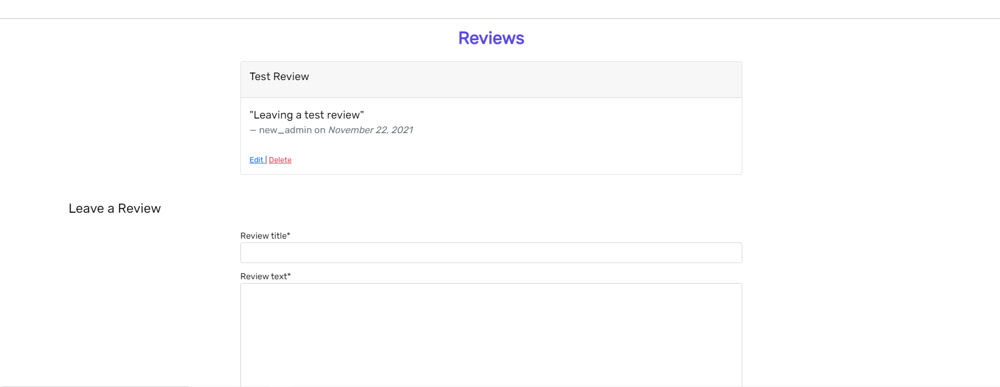

## HTML CSS and Python validation checks

### HTML

### CSS

### Python

## User Testing 

## Manual Testing

✔️ Navigation links: All redirect to the correct pages.

✔️ Try deleting Posts when not logged in: A 403 error page appears asking user to log in/register.

✔️ Try loading an unrecognised link page: A 404 error page appears sending the user back to the homepage.

✔️ Submit registration form with a user/email that already exists in database: User is prevented from signingin.

✔️ Submit registration form with one of the fields not filled in: An error message appears asking user to fill in the field.

✔️ Submit registration form with a new user/email that doesn't exist in database: Successfully adds user data to Admin Django back end and redirects user to the Home page. 

✔️ Submit Log In form if no username exists in database that matches entered username: Error message appears stating incorrect username and/or password.

✔️ Submit Log In form if username is correct but password doesn't match: User is prevented from signing in. An Error message appears stating incorrect username and/or password.

✔️ Submit Log In form with one of the fields not filled in: An error message appears asking user to fill in the field.

✔️ Submit log in form with correct username and password: Starts session and takes user to the profile page. 

✔️ Press the Sign Out button when logged in: Ends the session and sends user back to login/create user page. 

✔️ Try adding a review when logged in: Successfully creates a review and redirects user to the Product Detail page with review added. 

✔️ Try editing a review on the Product Detial page: Successfully edits the users review and returns to the Product Detail page.

✔️ Try deleting a review on the Product Detial page: Successfully deletes the users review and returns to the Products page.

✔️ Try deleting a review while on the Product Details page: User successfully deletes post and is taken back to the individual product page with the post removed

✔️ Search posts on site: If results found, post is rendered on the home page. If no results, message stating no results found and a return to home page button produced. 

✔️ Try logging in with the credentials from the deleted account: Get an error message. 

## Automatic Tetsing

# Bugs / De-Bugging / Syntax Issues

## Errors

### Homepage and nav

After initialising my **index.html** file and adding the installed view/app, I was met with a 'TemplateDoesNotExist' page. The server started correctly but the path I made seemed to cause the error:
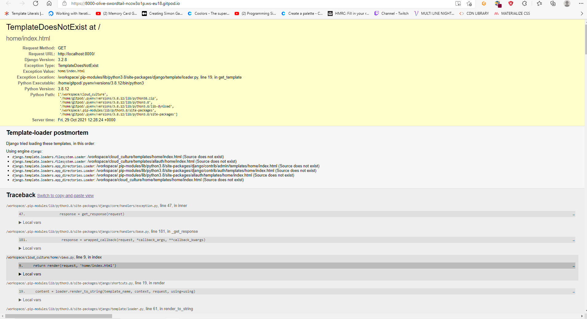
   To resolve the issue, I understood the error was not arising from the Python App View or code because the server ran with no issue. The problem lied within my filepath. The **index.html** file was not in the 'templates/home' folder but actually just inside 'templates'. The filepath should be **app_name > templates > app_name > index.html**

Found an error with my filter query functionality. The 'mods' category was correctly displaying all items in category pk1 / mods but none of the other categories displayed their products correctly. By deleting all the product urls but copying the mods syntax because I knew this one was rendering correctly, I was able to resolve the issue. I pasted "?category=mods" back into the anchor href, reloaded the page and the **mods** product page was rendering correctly. Then by pasting in this syntax to the other anchor links, just changing the category name, I was able to determine that the "accessory" page was the only one not working. I left this out from the "All Products" query and this page now loaded successfully with all the "Mod" and "Disposbale" vape products.

The same error occurred when trying to load products in the 'new_arrivals' category. I decided to move on and assess the situation later which actually provided me with the solution. After creating the "request.GET" method for **sorting** and created a category link for every product, I noticed that what should have been products in 'accessories' and 'new_arrivals' were showing old category names as shown below. 
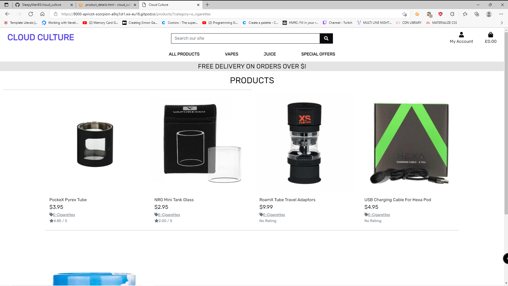
   This signaled to me, the **categories.json** file had not been loaded into the database with the new category names. Once loaded, the category pages rendered with the correct products. 

### Settings 

When creating a pathfile in **setting.py** for my static folder, the "STATICFILES_DIR" produced this error:
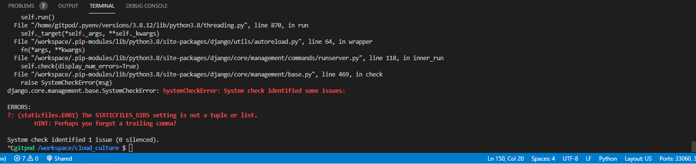
   To rectify the issue, as per the error message, I made the "STATICFILES_DIR" os.path into a tuple with this syntax | **STATICFILES_DIRS = (os.path.join(BASE_DIR, 'static'),)**

Encountered an error when trying to launch my new checkout app. The backend logic was all stable as the admin panel rendered as expected. The issue came when trying to inject the signals into the frontend. From the terminal, according to the message, the site app wouldn't start due to syntax error in signals.py:
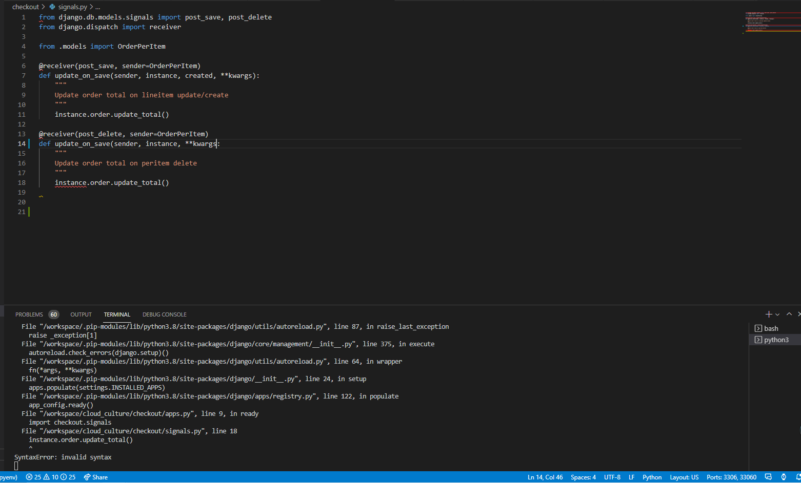
   As per most of the errors and bugs with this project, the error was due to a missing character. You can see I was missing a closing parenthesis in my definition **def update_on_save(sender, instance, **kwargs)**** This syntax fixed meant my app starting properly in the console. 

However, even though the app started, I was met with a **ModuleNotFoundError** which suggested to me there was an issue in the project level "settings.py"". Another error after fixing the previous was met when trying to render the checkout page:
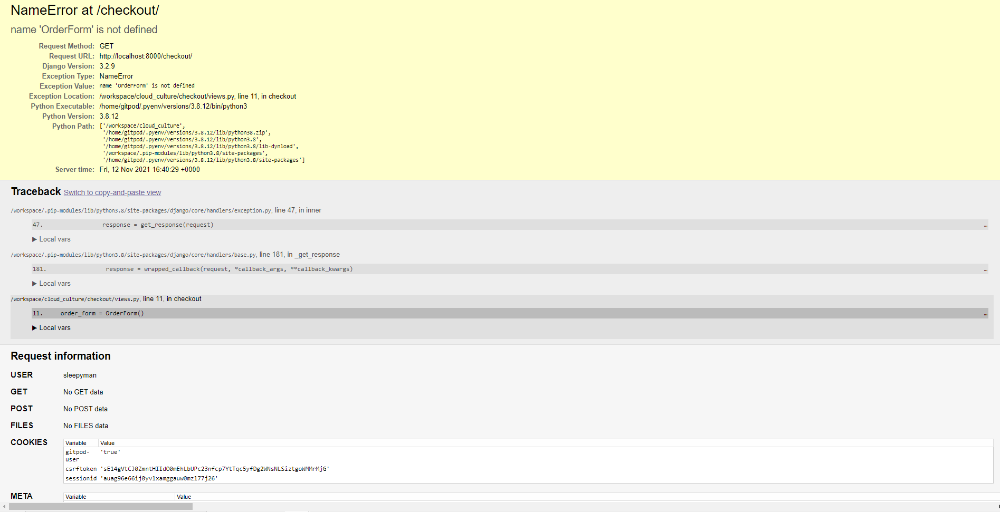
After reassessing my "checkout/views.py" code, it transpired that I forgot to import **OrderForm** from the **forms.py** model. 

### Render Issues

Found a 'NameError' when trying to create some reaction messages for users interacting with the site:
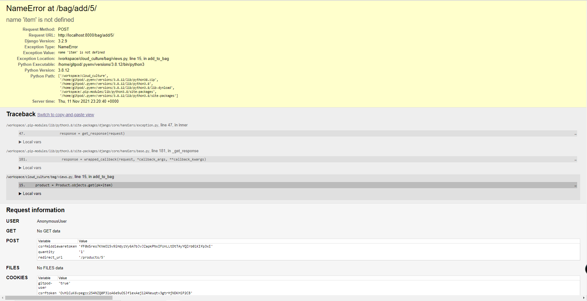
   The error was coming from the **pk** not being indicated with the item_id, my syntax was "Product.objects.get(pk=item)" when instead it should be "pk=item_id".  

### Checkout

The final error I was met with before the checkout page was rendered correctly was this:
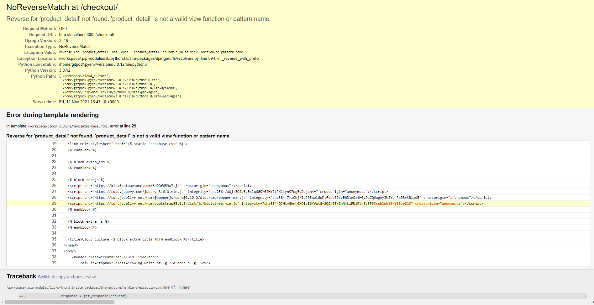
   My first thought was to locate the file causing the error. As I was trying to render the checkout page, I started in **checkout.html**. In the file I page searched for the missing view **product_view** and found the syntax that was causing the issue. Upon a furhter look in the "products" app, I realised the view needing to be used as the link was actually named **product_details** and not the **product_detail** url I had in the checkout.html file. Once I changed this and saved, the checkout page finally rendered.

Stripe payments and environment variables were all set up smoothly. I ran into my first error with this section when trying to render the "checkout_success" page:
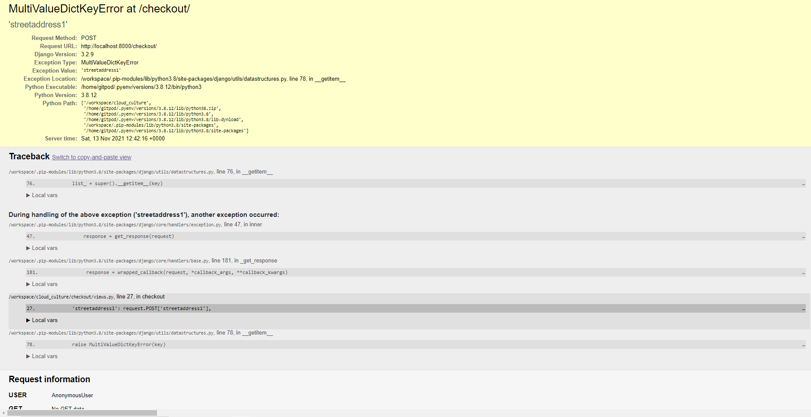
In keepting with most of my errors, the problem was due to the key not being in the checkout model dictionary. By putting an underscore in 'streetaddress1' like so 'street_address1', this corrected the issue but I was met with another error:
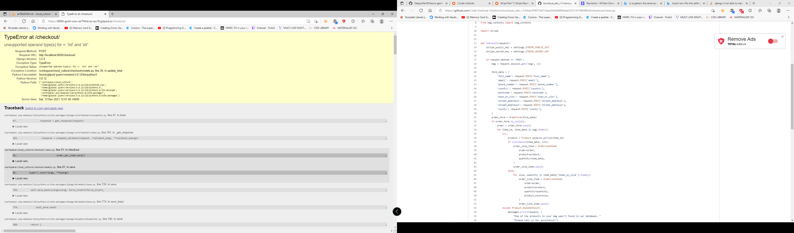
   This problem took a lot of working out. For some reason my 'peritem_total' which is supposed to be a decimal field was rendering as a string and causing the issue. From commenting out the order_form section of my checkout view, I was able to get the **checkout_success** page to render, as was the success message with the UUID. After a long time and some help from a tutor, we were able to determine the problem. The "Sum" built in method being called had a lower case 's' which was causing all the issues. Once edited, everything worked as expected and the order form saving correctly to the admin panel. 

### Stripe

Amongst a big heap of errors when setting up Stripe payments, mostly syntax issues, this JS error caused the most problems. It prevented webhooks being sent successfully to Stripe and therefore preventing order details and other hooks being sent to Stripe. After seeking help from the course tutors, who also had issues locating the problem, we managed to work out the Sum function was not being ran properly. Although it indicated a JS issue stating "Cannot set properties of null (setting 'textContent'), this part of the stripe_elements JS was present and supposed to fill with an error message. This caused the confusion as the error was actually originating from the "checkout.model", I retyped the sum model, making sure to capitilise the S and the Stripe payments begun to work.
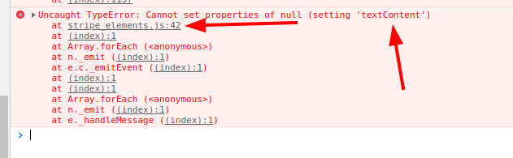

### Models

When implementing my review model, the features of the review all appeared on the individual product pages but found a reverse error later on when trying to load the review form. There was no issue with the model/view but the "product_details" page wouldn't load. 

Using ctrl+f, I searched for **product_detail** and changed the syntax to the correct **product_details** relating to the template name. Once corrected, I was still presented with the error. The problem was coming from my template, again having product_detail in one of my 'urls', once changed the page rendered correctly with the review form attached.

## Bugs

### Homepage

Encountered my first bug when building the homepage template. Everything appeared on screen as expted, with the search fucntion returning "q='search input'" signalling success but the dropdown functionality wasn't present. 
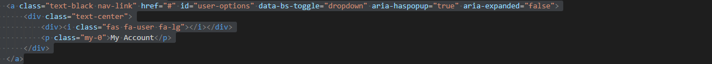
   The bug fix was due to JS and using Bootstrap 4 classes when I installed Bootstrap 5 with this project. To correct the issue, in Bootstrap 5, the "data-toggle" class has now been changed to "data-bs-toggle", the dropdown functionality is now working. 

When testing the responivness of my current elements, mainly the navbar section, I found two scaling issues. Using 'includes' I made a seperate HTML file for the navbar on mobile, essentially collapsing the content into icons. Using **d-block** and **d-lg-none**, the idea was to use template literals and inject the seperate HTML file after the standard navbar and for it to only show on small sizes and below. However, the ul was still showing as block, pushing the main-nav links right of center. Also when using dev tools, the icon and content appeared on a seperate line from the main-nav expandable dropdown. The image below demonstrates this:
- insert responsive-bug image

Found a bug once site was deployed where by some images linked in the HTML did not render. 
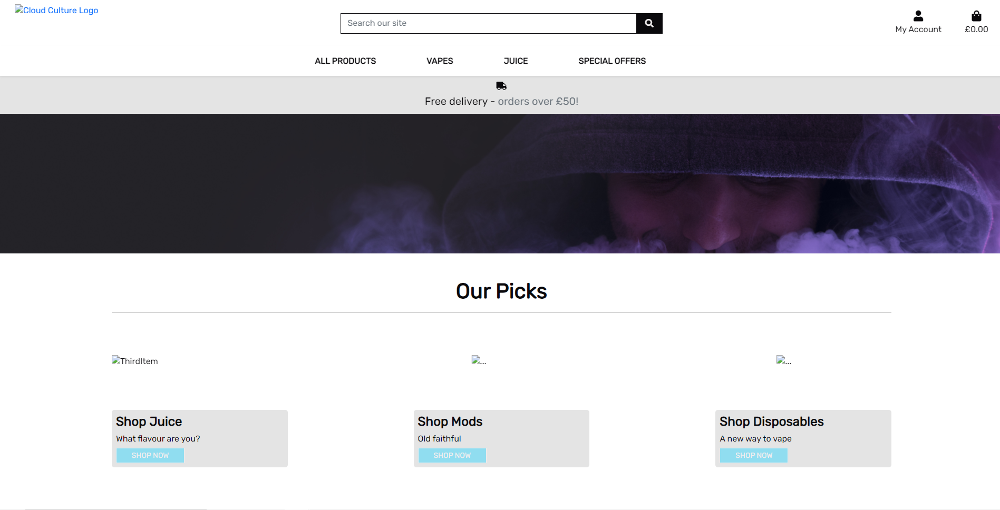
To correct this I just copied the Object URL for each image and used that as the source in the HTML files rendering them. Logo and carousel images on the homepage respectively.

### Product Page

Encountered a bug when trying to render an individual product page. I was met with a NameError, I believe to be originating from the product.views file:
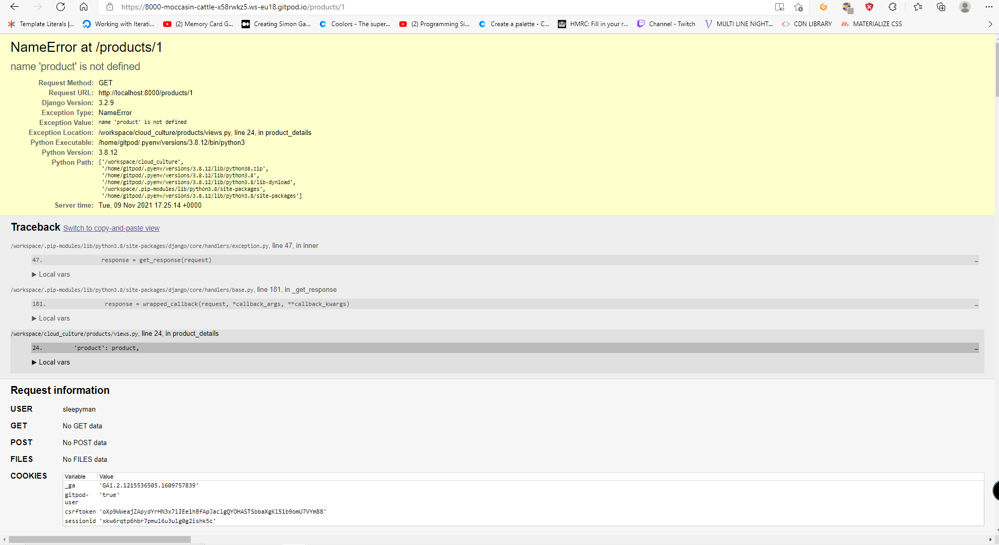
   The bug fix was found on line 24 as the error suggested. As I used the "all_products" view as the shell for the "product_details" view, I forgot to remove the s from the line "product = get_object_or_404(Product, pk=product_id)" meaning **'product': product,** could not be defined.

When testing my Javascript for the sorting box method, I found a bug trying to sort the products by 'Name A-Z / Z-A'. The issue was found in **view.py** on line 24, stating that "Lower" had not been defined.. After reassessing my code, it appeared that I hadn't imported the "Lower" function needed for the if statement to work. Once imported, the category dropdown selection works.

### Shopping Bag

Found a bug when making the shopping bag page. The page a view successfully load but for some reason only the "keep shopping" with chevron is the only content that appears on the page:
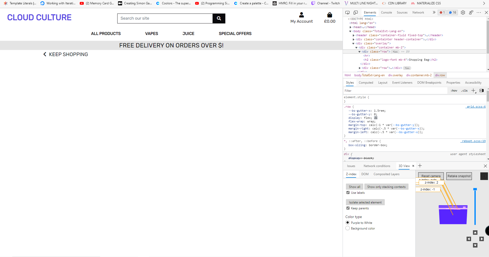
   The issue was due to the bag content not displaying under the header content. It took me a while to work out the issue but in the end, I used the **products.html** template as the base because this content was displaying correctly. In the end, the bug was due to the content being inside the "overlay" div. Once placed underneath, the content displayed as should.

Encountered another bug with the shopping bag but this time with the functionality. When I tried to add an item to the shopping bag, I was met with a TypeError stating "item_id" was an unexpected keyword argument:
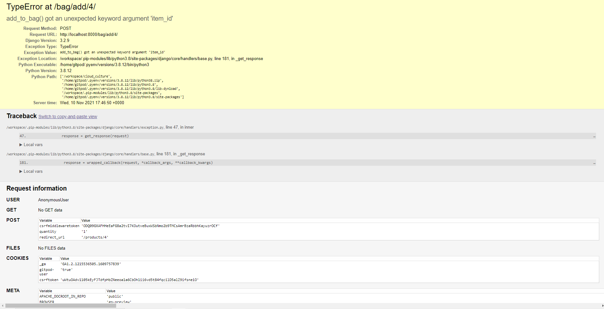
As the indicated, the problem was coming from the bag view. I forgot to define item_id as an argument in the "add_to_bag" function. 

Faced a very difficult bug when trying to render the nicotine level in the shopping bag. At first, the view wasn't creating a new item for the same product but with a different nicotine level, this was due to a typo in the bag **views.py**. However, the nicotine level wasn't rendering in the shopping bag, it showed N/A. To make sure there was a value, I placed **{{ item.product.has_nicotine }}** under the for loop to check if the item returned "True", once it had, I knew the nic level was storing in the dictionary. From here, I replaced it with **{{ item.nicotine }}**, which rendered the correct nicotine level. From here, I injected this logic back into the "if" bag statement and the nicotine level is now showing as expected.

### Checkout Page

In my checkout page, everything rendered as expected apart from the individual item images, subtotal and grand_total:
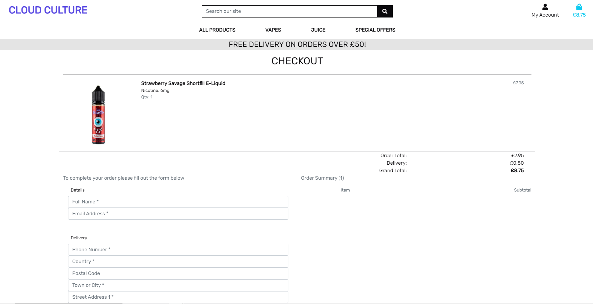
The bug was due to an issue with my "div" content. All the content, including product image, subtotal, details etc, needed to be enclosed in 
, insted only the content showing correctly eg. the subtotal header, was enclosed in this div. Corrected the issue and now all the information is displayed in the right format.

### Profile Page

Found a visual bug when adding the full name field to the profile form:
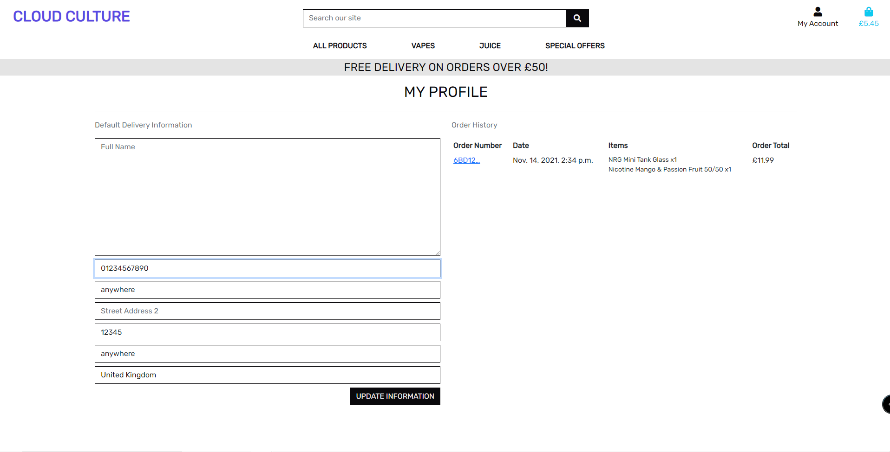
The bug was due to an error in my profiles model. For the 'default.full_name' input, I assigned it as a TextField which produced a big and unnecessary text box for the name input. Amended it to CharField and this resolved the bug.

# Technologies Used 

1. [jQuery](https://jquery.com/)
2. [Bootstrap5](https://getbootstrap.com/)
3. [CSS 4](https://www.w3schools.com/w3css/)
5. [HTML 5](https://en.wikipedia.org/wiki/HTML5)
6. [JavaScript](https://www.javascript.com/)
7. [Dev Tools](http://ami.responsivedesign.is/)
8. [jQuery](https://jquery.com/)
9. [Python](https://www.python.org/)
10. [Django](https://www.djangoproject.com/)
11. [Heroku](https://heroku.com)
12. [Stripe](https://stripe.com)

# Project Deployment 
## Process of deployment

#### Heroku:  

1. _For the Heroku app to successfully understand what **Framework Requirements** and Python applications to run, a **Procfile** and **requirements.txt** are a must..._  

Using the command **pip3 freeze --local > requirements.txt** in the terminal will create a requirements.txt file with all the dependencies listed to run the Heroku App. Whenever new packages are installed, remeber to update the .txt file | Using the command **echo web: python app.py > Procfile** in ther terminal will create a Procfile, which Heroku uses to know which Python App to run when the site is loaded.  

2. _After initial set up, our next step is to get Heroku to update, recognise and connect with our site..._  

To do this, you need to make an account on Heroku, upon signing in, click **New** to create the app. On the next screen, produce a name for the app, making sure to use lowercase and the region closest to you. If the domain name is available, finish by clicking **Create App**.

4. _Upon creating the app, we need to set up the postgres and install required files to gitpod_

Navigating to the resources tab, search for POSTGRES and choose the free Heroku plan. Then move back to gitpod and install **dj_database_url** and **psycopg2-binary**. Not forgetting to update the requirements.txt file with the new installations and importing **dj_database_url** to the top of our project level settings.

5. _Now to make some changes to settings.py_

Coment out the DATABASES and replace the default database with a call to **dj_database_url.parse** passing in the database URL from Heroku. This can be found under the 'Settings' tab and revealing config vars. Make sure to place the url in quotation marks.

6. _Postgres migration_

Due to the fact we are not connecting to Postgres after this setup, a migration of all the app models in neccessary for the app to run. Simply run migrate as you would have normally to set up all the previous apps localy. As I've used json fixtures for my app, I can just load the data from these on to the new Postgres host. Making sure to create a new superuser after these migrations so that you are able to login.

The last thing to do is uncomment the settings.py DATABASES and remove the one using the POSTGRES url so that the app doesn't end up in version control.

7. _if statement in settings.py when running on Heroku and other dependencies_

There needs to be an if statement to determine which database to run from. When running from Heroku, we can use the DATABASE_URL in the environ variables to connect with Postgres. Else, the DATABASE will be connected to sqlLite and run from there.

After this, install **gunicorn**, which will act as the webserver and freeze. Then create the Procfile to tell Heroku to create a web dyno which will run unicorn and serve the django app. Inside the Procfile create the following code: "web: gunicorn (app named).wsgi:application"

8. _Command line configuration_

Once this is saved, login to Heroku from the terminal using Heroku Login (Don't forget to update if needed with Heroku update). Once logged in, run "heroku config:set DISABLE_COLLECTSTATIC=1 --app (heroku app name)" so that static files won't be collected when deploying. Then the Heroku app URL needs to be added to allowed hosts in the project level settings.py, as well as 'localhost' so that the project can still be run locally on Gitpod.

After all has been saved and pushed to github, we need to push changes to Heroku. If the app was set up online and not in the CLI, run "heroku git:remote -a (heroku app-name)" and then try running git push heroku master.

9. _Next we need to have our code update on Heroku automatically. The easiest way to do this is linking the sites repo in Github with the Heroku app..._  

Navigate to the **Deploy** tab and choose **github** as the **Deployment Menthod**. Sign in and Search for the repo name. Once found, choose **connect**.  

10. _Due to the fact we have hidden KEY Environment Variables in the **env.py** file, that Heroku won't be able to retrieve from the **GitHub Repo**, we need to store this in Herkou's **Config Vars**..._  

Under the settings tab you will find the **Config Vars** section. Reveal the section and copy all the **KEY** and **VALUE** pairs from the **env.py** file. Making sure not to include any of the **quotation marks**.  

11. _For the last stage, it is key to make sure the **requirements.txt** and **Procfile** are pushed to the GitHub Repo..._   

Once these files are successfully pushed to GitHub, make sure to **Enable Automatic Deploy**. You can then click **Deploy Branch**, generally **main** or **master**. The Heroku app will take a few minutes to set up the connection. Once successful, every commit pushed to GitHub will update the Heroku app and Live Site.

### AWS S3

1. _Create AWS account_

Head to aws.amazon.services and create an account following the steps. Once signed in, go to the 'Management Console'

2. _S3 setup_

Search for S3 in the services search section. Clck on the 'bucket' link attached to the S3 link and create a new bucket, matching the name with the Heroku app for consistency. Make sure when setting this up to uncheck 'Block **all** public access', as the app will need to allow users to access the static files.

3. _bucket configuration_

Access the bucket and head to properties. Scroll to the bottom and enable the section for 'static web hosting' so that we can host the static site. After this head to the permissions tab and paste in the following CORS configuration:
                     [
            {
                  "AllowedHeaders": [
                     "Authorization"
                  ],
                  "AllowedMethods": [
                     "GET"
                  ],
                  "AllowedOrigins": [
                     "*"
                  ],
                  "ExposeHeaders": []
            }
            ]

Next a policy needs to be generated for the bucket. Navigate up slightly on the same page, click edit on policy settings and generate a new policy. When redirected, select:
- S3 Bucket Policy
- Use * as the principal and the Action set to 'Get Object'
- Copy the ARN (Amazon Resource Name) from the previous Policy tab and paste into the ARN section of the form
- Click Add Statement, Generate Policy and then copy the Policy into the JSON handler on the previous tab. Make sure to add /* at the end of the resource key to allow access to all resources
- Lastly, edit the ACL found on the same page and allow list permissions for everyone.

4. _IAM Setup_

Now that the s3 bucket is set up. You now need to create a user in order to access the bucket. To do this use another Amazon service called IAM (identity and Access Management):

- Search for IAM the same way previously done for S3
- Click on groups and create a new group. Ignore other sections.
- Navigate to Policy tab on the left and create policy
- Head to the JSON tab and import managed policies. Searching for S3 and import full access policy.
- Find the ARN from the S3 bucket policy and paste into the IAM JSON tab. A list will be used here, one item for the bucket, one adds another rule for all files/folders in bucket:
         {
            "Version": "2012-10-17",
            "Statement": [
               {
                     "Effect": "Allow",
                     "Action": [
                        "s3:*",
                        "s3-object-lambda:*"
                     ],
                     "Resource": [
                        "arn:aws:s3:::cloud-culture",
                        "arn:aws:s3:::cloud-culture/*"
                     ]
               }
            ]
         }
- Review the policy making sure to add a name and description, then click create policy
- Head back to User Groups in the IAM section, click on the new manage group. Once inside, click policies and choose the dropdown Add Permissions, choosing Attach Policies
- Attach the new policy just created by checking the box and attach policies
- Next we need to create a user for the group. Head to users and create user with a name and giving programmatic access
- Attach this new user to the group and click through to the end.
- Once successfully added, download the CSV file (VERY IMPORTANT) as we can't re-access this

5. _Connect Django to Bucket_

Two new packages are installed for this:
**boto3**
**django-storages**

Once installed, make sure to freeze the requirements.txt file so that Heroku is up to date and add storages into the list of installed apps.

To connect Django to s3, you'll need to add some parameters in settings.py to tell Django which bucket it is communicating with:
      AWS_STORAGE_BUCKET_NAME = 'bucket name'
      AWS_S3_REGION_NAME = 'region'
      AWS_ACCESS_KEY_ID = os.environ.get('AWS_ACCESS_KEY_ID')
      AWS_SECRET_ACCESS_KEY = os.environ.get('AWS_SECRET_ACCESS_KEY')
      AWS_S3_CUSTOM_DOMAIN = f'{AWS_STORAGE_BUCKET_NAME}.s3.amazonaws.com'
- Go to Heroku, in the convig vars, add USE_AWS = True. Add the AWS access key and secret access key
- Remove disable collectstatic from Heroku config vars
- Create a file called custom_storages.py, adding the following code:

- In settings.py add the following statements to tell Django where the static files will come form in production:
      STATICFILES_STORAGE = 'custom_storages.StaticStorage'
      STATICFILES_LOCATION = 'static'
      DEFAULT_FILE_STORAGE = 'custom_storages.MediaStorage'
      MEDIAFILES_LOCATION = 'media'

- Then git commit all changes
- For all the media files, just navigate to the S3 bucket, add a folder named 'media' and upload all the site images here making sure to grant public access.

## How to create Local Version

#### Clone the repository and run locally:

1. Navigate to the repository from the Github Dashboard
1. Select the "Code" button, top right of the frame 
1. Click on the clipboard icon to the right of the URL to copy it
1. Open an Integrated Development Environment (IDE) and head over to the terminal
1. Change the directory to where you want to clone the repository to
1. Execute the following command by pasting in the URL you copied in step 3: git clone https://github.com/SleepyMan93/escro-games
1. Press Enter
1. The site will then be cloned
1. Install all the project dependencies by typing `pip install -r requirements.txt`

[Back to Top](#table-of-contents)

# References 
- Aside from [StackOverflow](htttps://www.stackoverflow.com) and some basics from the Code Institute Mini Project, all the code was produced by me.

# Acknowledgements 
I'd really love to thank Gerry my Tutor for helping me with my project. He gave me some great insight into principles, structure and 
overall any problems I had. 
